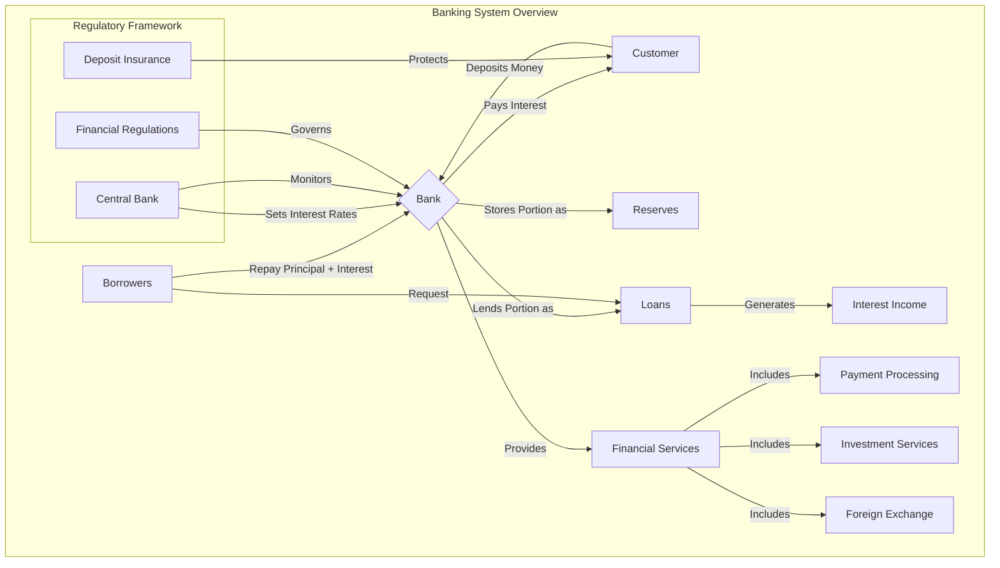

# Banking System Overview

This repository contains a demonstration of how banking systems work, illustrated with a Mermaid diagram.

## How Banks Work

Banks operate as financial intermediaries between depositors and borrowers. They take deposits from customers, maintain reserves, and lend out the remaining funds to generate income through interest and fees.

## Banking System Flow

## Key Banking Functions

1. **Deposit Taking**: Banks accept and safeguard deposits from individuals and businesses.
2. **Lending**: Banks provide loans to individuals and businesses, generating income through interest.
3. **Payment Services**: Banks facilitate money transfers, bill payments, and other transaction services.
4. **Investment Services**: Many banks offer investment products and wealth management.
5. **Risk Management**: Banks assess and manage various financial risks.

## Modern Banking Challenges

- Cybersecurity threats
- Regulatory compliance
- Competition from fintech startups
- Digital transformation requirements
- Economic uncertainty and interest rate fluctuations

## Banking Industry Evolution

The banking industry continues to evolve with technological advancements, changing customer expectations, and regulatory developments. Modern banks increasingly focus on digital services, personalized customer experiences, and innovative financial products.